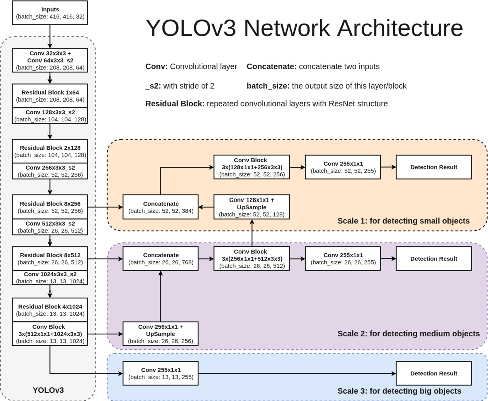

# YOLOv3: a Tensorflow 2.0 Implementation

I propose an implementation of YOLOv3 using Tensorflow 2.0. For example purposes, I use the [Penn-Fudan Database for Pedestrian Detection and Segmentation](https://www.cis.upenn.edu/~jshi/ped_html/).

I am using the architecture from the original paper:

Overview of the YOLOv3 architecture

[Reference](https://www.cyberailab.com/home/a-closer-look-at-yolov3)

See the Jupyter Notebook for more info!
